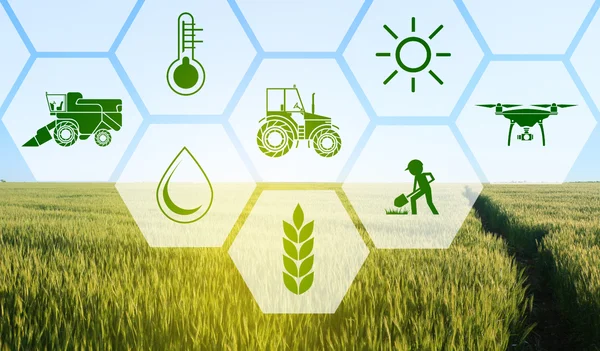
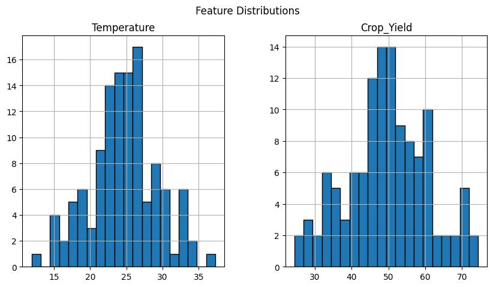
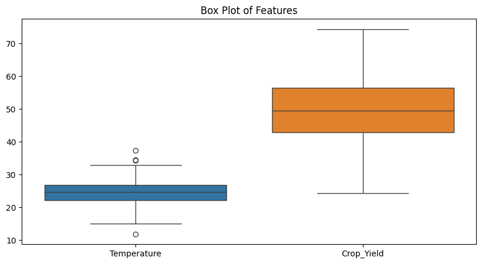
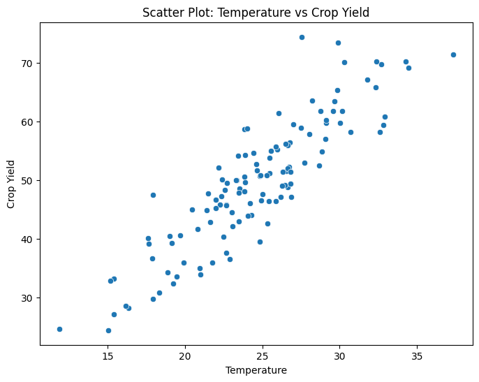
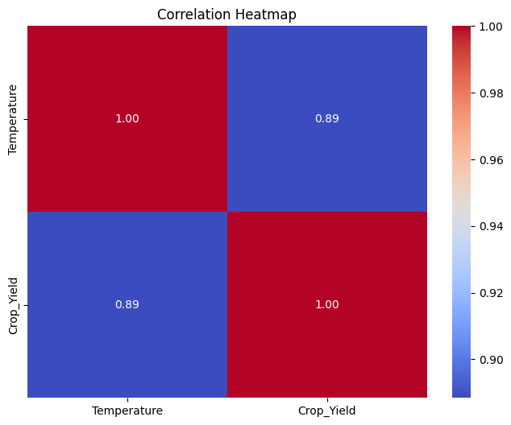
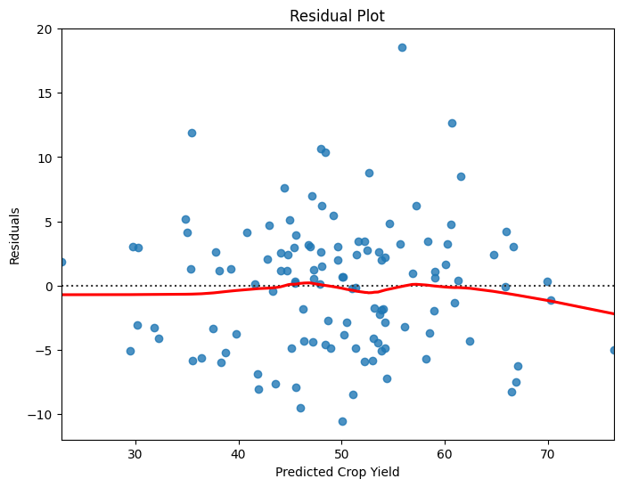

# **PREDICTION OF FUTURE FARM YIELD**  
**_Simple Linear Regression | Jupyter Notebook_** 



## **INTRODUCTION**  
Accurate crop yield prediction is crucial for agricultural planning and food security. This project applies **Simple Linear Regression** to predict future farm yields based on temperature variations. The goal is to determine how temperature influences crop yield and build a predictive model that can assist farmers and policymakers in making informed decisions.

---

## **PROBLEM STATEMENT**  
Agriculture is highly dependent on weather conditions, with temperature being a critical factor affecting crop yield. This project aims to analyze historical data on **temperature and crop yield**, identify relationships, and build a **predictive model** to forecast future yields based on temperature trends.

---

## **SKILL DEMONSTRATION**  
- **Data Analysis & Cleaning**: Handling missing values and understanding dataset structure.  
- **Exploratory Data Analysis (EDA)**: Summary statistics, visualizations, and correlation analysis.  
- **Feature Engineering**: Identifying key predictors for yield prediction.  
- **Model Building & Evaluation**: Implementing **Simple Linear Regression** and analyzing residuals.  
- **Visualization & Interpretation**: Scatter plots, heatmaps, and residual plots for insights.  

---

## **DATA SOURCING**  
The dataset used in this project is publicly available and contains observations of:  
- **Temperature (°C)** – Independent variable.  
- **Crop Yield (units specific to the crop)** – Dependent variable.  
The data was sourced from [Explore-AI Public Data](https://raw.githubusercontent.com/Explore-AI/Public-Data/master/Data/Python/crop_yield_dataset.csv).

---

## **EXPLORATORY DATA ANALYSIS (EDA)**  
EDA was performed to understand the dataset and identify patterns. Key steps included:  

### **1. Data Overview**  
- Checked **data types** and **missing values** using `.info()` and `.isnull().sum()`.  
- Generated **summary statistics** using `.describe()`.  

### **2. Data Distribution Analysis**  
- **Histograms** to visualize the distribution of Temperature and Crop Yield.  
- **Box plots** to identify outliers.

   
    

### **3. Feature Relationships & Correlation Analysis**  
- **Correlation heatmap** to identify relationships between features.  
- **Scatter plot** of **Temperature vs. Crop Yield** to observe trends.

### **4. Residual Analysis (After Model Fitting)**  
- Fitted a **Simple Linear Regression model**.  
- **Residual plot** to check for patterns in prediction errors.  
   
#### **Key Insights from EDA:**  
- **Strong correlation** between **Temperature and Crop Yield**.  
- **No significant missing values** in the dataset.  
- **Linear relationship observed**, making it suitable for linear regression modeling.  

---

## **MODELLING**  
A **Simple Linear Regression model** was trained to predict crop yield based on temperature.  

### **1. Model Implementation**  
- **Independent Variable (`X`)**: Temperature  
- **Dependent Variable (`y`)**: Crop Yield  
- **Model Used**: `sklearn.linear_model.LinearRegression`  
- **Training & Testing**: Split dataset using `train_test_split()` (80% training, 20% testing).  

### **2. Model Evaluation**  
- **Mean Absolute Error (MAE)**  
- **Mean Squared Error (MSE)**  
- **R² Score (Coefficient of Determination)**  

---

## **ANALYSIS & VISUALIZATION**  

### **1. Temperature vs Crop Yield (Scatter Plot)**  
- Visualized the **relationship between Temperature and Crop Yield**.  
- Fitted a **regression line** to observe trends.  

   

### **2. Correlation Heatmap**  
- Displayed the **correlation matrix** to confirm linear relationships.  

   

### **3. Residual Plot**  
- Checked for **heteroscedasticity** (random distribution of residuals).  

   

### **4. Model Performance Metrics**  
- Evaluated prediction accuracy using **MAE, MSE, and R² score**.  

---

## **CONCLUSION**  
1. **Temperature has a significant impact on crop yield**, as observed from the correlation analysis.  
2. The **Simple Linear Regression model successfully predicts crop yield** based on temperature variations.  
3. **Future Improvements**:  
   - Incorporate **more variables** (e.g., rainfall, soil quality, fertilizer use) to improve model accuracy.  
   - Apply **Polynomial Regression or Machine Learning models** for better predictions.  
   - Explore **time-series forecasting** for long-term yield predictions.  

---

## **HOW TO RUN THE PROJECT**  
### **1. Prerequisites**  
Ensure you have Python installed along with the required libraries:  
```bash
pip install numpy pandas matplotlib seaborn scikit-learn
```
### **2. Clone the Repository**  
```bash
git clone https://github.com/Bjoshua25/Farm-Yield-Prediction.git
cd Farm-Yield-Prediction
```
### **3. Run the Jupyter Notebook**  
```bash
jupyter notebook Prediction_of_Farm_Yield_Analysis.ipynb
```
